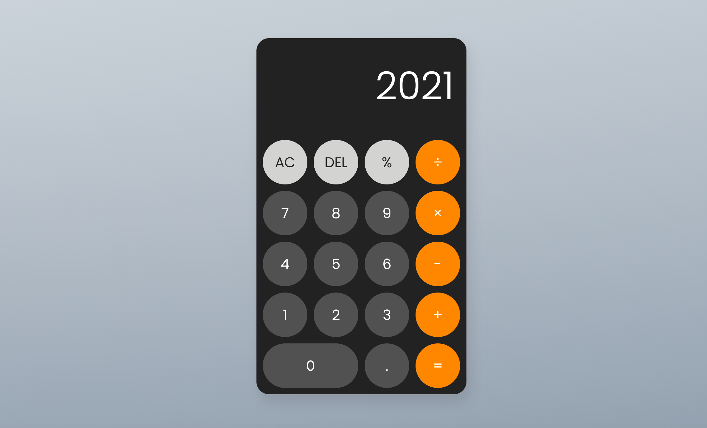

# Calculator

Screenshot :



# Directory's tree

```
.
|-- README.md
|-- demo.png
|-- client
|   |-- index.html
|   |-- main.js
|   `-- style.css
|-- calc
|   |-- calc.go
|-- main.go
`-- server
    `-- server.go
```
