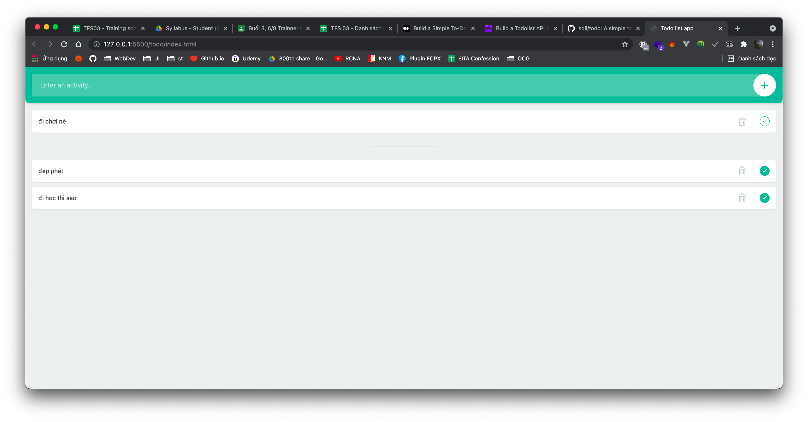
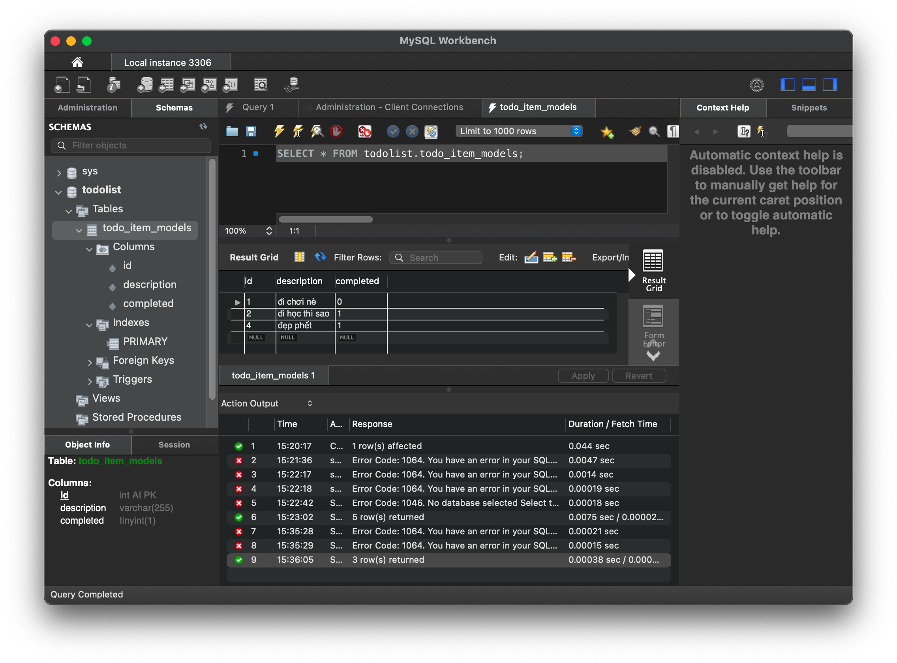

# Todo app with Go & MySQL

Tutorial: [TUT](https://www.fadhil-blog.dev/blog/golang-todolist/)

# Screen




# Directory's tree

```
.
`-- todo-go-mysql
    |-- README.md
    |-- mysql.png
    |-- todo
    |   |-- LICENSE.md
    |   |-- README.md
    |   |-- index.html
    |   `-- resources
    |       |-- css
    |       |   |-- reset.min.css
    |       |   `-- style.css
    |       `-- js
    |           `-- main.js
    |-- todo.png
    `-- todolist.go
```
